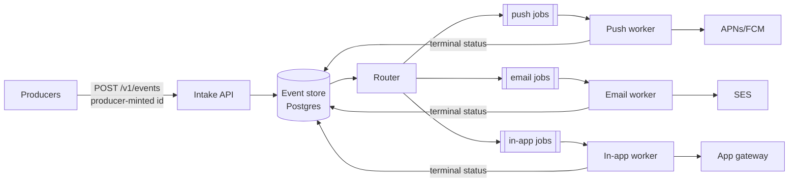

# Example: System Design Document

An abbreviated but structurally complete example. Real documents expand each
section; the shape and the prose discipline are the point.

---

# Relay - Notification Fan-out Service

**Status:** DRAFT FOR APPROVAL. **Author:** J. Ortiz (jo@example.com).
**Created:** 2026-05-11. **Location:** docs/design/relay-design.md.
**Approvers:** platform lead, mobile lead.

## Objective

Deliver one user-facing event to every subscribed channel (push, email,
in-app) through one service, so product teams stop writing per-channel
delivery code.

## Background

Three teams deliver notifications today. Each team wrote its own retry logic.
The support queue shows 40 duplicate-notification reports in April. The
billing team sent one receipt email three times because two workers raced on
one row. We verified this in `billing/worker.py:214`: the job table has no
idempotency key. No shared service exists. This document proposes one.

## Goals

- A product team ships a new notification with configuration only, no
  delivery code.
- A user receives each event at most once per channel.
- A channel outage does not block other channels.

## Non-goals

- Marketing campaigns and bulk sends. Rate shapes differ; out of scope.
- User notification preferences UI. Relay reads preferences; it does not
  edit them.

## The system in one paragraph

Producers write events to Relay's intake API. Relay stores each event once,
keyed by a producer-minted event id. A router expands each event into
per-channel jobs. Channel workers deliver jobs with per-channel retry and
report terminal status. The event store is the only durable truth; workers
are stateless.

## Architecture

## Component responsibilities

| Component | Owns | Must never |
|---|---|---|
| Intake API | Event admission, dedup on (producer, event id) | Deliver anything |
| Event store | Durable events and per-channel job status | Be bypassed by a worker |
| Router | Expansion of one event into channel jobs per user preferences | Retry deliveries |
| Channel workers | Delivery, per-channel retry with backoff, terminal status | Mint events or edit preferences |

## Interfaces

Intake: `POST /v1/events` with `{event_id, user_id, kind, payload}`. Replay
of a seen `(producer, event_id)` returns the stored result (200, not 409).
Missing `event_id` is rejected; server-minted ids would destroy idempotency.

Worker edge: workers lease jobs with `SELECT ... FOR UPDATE SKIP LOCKED`,
heartbeat every 15 s, and lose the lease after 60 s silence. A retried job is
safe because delivery calls carry the job id as the provider idempotency key.

## Failure semantics

- Channel provider down: that channel's jobs back off; other channels do not
  see it. Traced scenario in section "Scenarios".
- Router crash mid-expansion: expansion is one transaction per event; partial
  expansion cannot commit.
- Worker crash after delivery, before status write: the lease expires, the
  job retries, the provider idempotency key absorbs the duplicate.

## SLOs and monitoring

- Delivery p50 under 5 s, p99 under 60 s, per channel.
- Page when any channel's oldest unleased job exceeds 5 minutes.
- Page when dedup-hit rate exceeds 5% (a producer is retry-storming).

## Security

Producers authenticate with per-service tokens scoped to their event kinds.
The trust boundary is the intake API; workers trust the store. Payloads may
contain user content: encrypted at rest, never logged (log event ids only).

## Scenarios

Maya's team ships "export finished". They register the kind, add a template,
and send one test event. SES has an outage that night. Email jobs back off
with jitter; push delivery stays under 5 s. When SES returns, the email
worker drains the queue oldest-first. Maya's user gets one email, not three.

## Open issues

- **In-app gateway protocol.** Options: reuse the app's existing WebSocket
  gateway, or poll from the client. Proposal: reuse the gateway. Next step:
  capacity check with the app team.

## Alternatives considered

- **Per-team libraries instead of a service.** Rejected: keeps N retry
  implementations and N idempotency bugs; the April incident was this shape.
- **Kafka instead of Postgres queues.** Rejected for now: we run no Kafka
  today, and the volume (about 50 events/s peak) does not justify a new
  stateful system. Revisit above 500 events/s.
